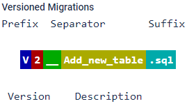
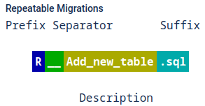

# Dumbo


[](https://index.scala-lang.org/rolang/dumbo/dumbo)
[](https://index.scala-lang.org/rolang/dumbo/dumbo)


Simple database migration tool for [Postgres](https://www.postgresql.org) with [skunk](https://typelevel.org/skunk/).  
Usable via command-line or as library in your Scala project targeting JVM or Native (see [usage example](#usage-example)).  
Supports a subset of [Flyway](https://flywaydb.org) features and keeps a Flyway compatible history state to allow you to switch to Flyway if necessary.  
You might also be able to simply switch from Flyway to Dumbo without any changes in migration files or the history state, depending on used Flyway features.

## Currently supports:

### Versioned Migrations

As described in _[Flyway Versioned Migrations docs](https://documentation.red-gate.com/flyway/flyway-concepts/migrations/versioned-migrations)_:

The most common type of migration is a versioned migration. Each versioned migration has a version, a description and a checksum. The version must be unique. The description is purely informative for you to be able to remember what each migration does. The checksum is there to detect accidental changes. Versioned migrations are applied in order exactly once.

Each versioned migration must be assigned a unique version.  
 A simple increasing integer or any version is valid as long as it conforms to the usual dotted notation:

- 1
- 001
- 5.2
- 1.2.3.4.5.6.7.8.9
- 205.68
- 20130115113556
- 2013.1.15.11.35.56
- 2013.01.15.11.35.56



### Repeatable Migrations

As described in _[Flyway Repeatable Migrations docs](https://documentation.red-gate.com/flyway/flyway-concepts/migrations/repeatable-migrations)_:

Repeatable migrations have a description and a checksum, but no version. Instead of being run just once, they are (re-)applied every time their checksum changes.



This is very useful for managing database objects whose definition can then simply be maintained in a single file in version control. They are typically used for
 
(Re-)creating views/procedures/functions/packages/...
Bulk reference data reinserts
Within a single migration run, repeatable migrations are always applied last, after all pending versioned migrations have been executed. 
Repeatable migrations are applied in the order of their description.
 
It is your responsibility to ensure the same repeatable migration can be applied multiple times. This usually involves making use of CREATE OR REPLACE clauses in your DDL statements.


### Script Config Files

Similar to [Flyway script config files](https://documentation.red-gate.com/flyway/reference/script-configuration) it's possible to configure migrations on a per-script basis.

This is achieved by creating a script configuration file in the same folder as the migration.  
The script configuration file name must match the migration file name, with the `.conf` suffix added.

For example a migration file `db/V1__my_script.sql` would have a script configuration file `db/V1__my_script.sql.conf`.

#### Structure

Script config files have the following structure:

```
key=value
```

#### Reference

- **executeInTransaction**  
  Manually determine whether or not to execute this migration in a transaction.

  This is useful where certain statements can only execute outside a transaction (like `CREATE INDEX CONCURRENTLY` etc.)  
  Example:

  ```
  executeInTransaction=false
  ```

  ⚠️⚠️  
  **NOTE**: Dumbo will attempt to execute each migration as a [simple query with multiple statements](https://www.postgresql.org/docs/current/protocol-flow.html#PROTOCOL-FLOW-MULTI-STATEMENT) 
  in a transaction by default (unlike Flyway which may decide not to do so).  
  To disable it you need to set it explicitly using the configuration above.  

  Use with care and try to avoid where possible. Partially applied migrations will require manual intervention.  
  Dumbo is not going to update the history state in case of partial failures.  
  If you re-run the migration process it will attempt to execute the script the same way it did before it failed.  
  To fix it you'd need to roll back applied updates manually and then update the migration script and/or split it into multiple files before re-running the migration process.  
  ⚠️⚠️  

## Usage example

For usage via command line see [command-line](#command-line) section.

In a sbt project dumbo can be added like:

```scala
libraryDependencies += "dev.rolang" %% "dumbo" % "0.6.x"
```

_For compatibility with skunk `0.6.x` / natchez / Scala 2.12.x use release series `0.0.x`_:

```scala
libraryDependencies += "dev.rolang" %% "dumbo" % "0.0.x"
```

To include snapshot releases, add snapshot resolver:

```scala
resolvers += "Sonatype Central Snapshots" at "https://central.sonatype.com/repository/maven-snapshots"
```

Examples can be viewed in [modules/example](./modules/example/).  
Similar to usage of the Flyway Java library, given versioned migrations in the resources folder:

```
example
  src
    main
      resources
        db
          migration
            R__test_view.sql
            V1__test.sql
            V3__test_c.sql
            V2__test_b.sql
```

The migration can be executed like:

```scala
//> using scala 3.7.1
//> using resourceDir ../resources
//> using dep "dev.rolang::dumbo::0.6.0"

import cats.effect.{IO, IOApp}
import dumbo.logging.Implicits.console
import dumbo.{ConnectionConfig, Dumbo}
import org.typelevel.otel4s.trace.Tracer.Implicits.noop

object ExampleApp extends IOApp.Simple:
  def run = Dumbo
    .withResourcesIn[IO]("db/migration")
    .apply(
      connection = ConnectionConfig(
        host = "localhost",
        port = 5432,
        user = "root",
        database = "postgres",
        password = None,
        ssl = ConnectionConfig.SSL.None,
      )
    )
    .runMigration
    .flatMap: result =>
      IO.println(s"Migration completed with ${result.migrationsExecuted} migrations")
```

To run the example, start a Postgres server via docker:

```shell
docker compose up pg_latest_1
```

Execute the example via [scala-cli](https://scala-cli.virtuslab.org):
```shell
scala-cli modules/example/src/main/scala/ExampleApp.scala
```

or via [sbt](https://www.scala-sbt.org):

```shell
sbt 'example/runMain ExampleApp'
```

## Configurations

### Configure the resources

To read migration scripts from embedded resources:

```scala
val dumboWithResouces = Dumbo.withResourcesIn[IO]("db/migration")
```

Notes:

- In Scala 3 the resource files will be listed / checked at compile time.
  In case the resource location can't be found in the classpath or multiple locations were found, a compilation error will appear.
- For Scala Native ensure to have [embedded resources](https://scala-native.org/en/stable/lib/javalib.html?highlight=resources#embedding-resources) enabled.
- In Scala 2 the resource location will be checked at runtime
- In Scala 2 + Native you'll be required to pass a list of resources as we can't list resources from a location at runtime, e.g. like:

```scala
val dumboWithResouces = Dumbo.withResources(
  List(
    ResourceFilePath("/db/migration/V1__test.sql"),
    ResourceFilePath("/db/migration/V2__test_b.sql"))
  )
```

To read migration scripts from the files system use:

```scala
val dumboWithResouces = Dumbo.withFilesIn[IO](
  fs2.io.file.Path("modules/example/src/main/resources/db/migration")
)
```

### Apply further configuration:

```scala
dumboWithResouces.apply(
  // connection config
  connection: dumbo.ConnectionConfig = dumbo.ConnectionConfig(
    host = "localhost",
    port = 5432,
    user = "postgres",
    database = "postgres",
    password = Some("postgres"),
    ssl = dumbo.ConnectionConfig.SSL.None, // SSL config, default is dumbo.ConnectionConfig.SSL.None
  ),

  // default schema (the history state is going to be stored under that schema)
  defaultSchema: String = "public",

  // schemas to include in the search
  schemas: Set[String] = Set.empty[String],

  // migration history table name
  schemaHistoryTable: String = "flyway_schema_history",

  // compare migration files with applied migrations
  // check e.g. for changed file content/description or missing files before migration
  validateOnMigrate: Boolean = true
)

// migration progress logs can be added optionally in case you'd like dumbo to provide some feedback on longer running queries
// it will perform requests to Postgres in given interval to check for queries that are causing the lock on migration history table
dumboWithResouces.withMigrationStateLogAfter[IO](5.seconds)(
  /* use config as above */
)

// in some cases you may want to provide a custom skunk session instead of connection config
// NOTE: given a connection config, dumbo will construct a session that will include given schemas into the search path via session parameters
// for custom sessions the search_path will be updated via the SET command if it doesn't match given schemas config which is not recommended (see https://typelevel.org/skunk/reference/Sessions.html#session-parameters)
// you may consider adding the search_path to the parameters yourself in that case, dumbo will log it as a warning
dumboWithResouces.withSession(
  defaultSchema = "schema_1", // consider updating the search_path for non default schema settings
  sessionResource = skunk.Session.single[IO](
    host = "localhost",
    port = 5432,
    user = "postgres",
    database = "postgres",
    password = Some("postgres"),
    // add schemas to the search path
    // those are added by default when using a dumbo.ConnectionConfig
    parameters = skunk.Session.DefaultConnectionParameters ++ Map(
      "search_path" -> "schema_1"
    ),
    // a strategy other than BuiltinsOnly should not be required for running migrations
    // you may want to keep that
    strategy = skunk.util.Typer.Strategy.BuiltinsOnly,
  )
)
```

### Logging
Dumbo requires a `dumbo.logging.Logger` instance.  
To use a logger based on `cats.effect.std.Console` that is required by `skunk` add the import:
```scala
import dumbo.logging.Implicits.console
```

Or provide a custom logger like:
```scala
given dumbo.logging.Logger[F] =
  case (dumbo.logging.LogLevel.Info, message) => ???
  case (dumbo.logging.LogLevel.Warn, message) => ???
```

For an example based on [log4cats](https://github.com/typelevel/log4cats) with [Slf4J](https://slf4j.org/) see [ExampleLog4Cats.scala](modules/example/src/main/scala/ExampleLog4Cats.scala).

## Command-line

Dumbo ships with a command line tool as a native binary.

### Download and installation

Note: the executable depends on [utf8proc](https://github.com/JuliaStrings/utf8proc) and [s2n-tls](https://github.com/aws/s2n-tls).

#### Linux

##### Arch

```shell
# install prerequisites
sudo pacman -S s2n-tls libutf8proc

# download and run dumbo
curl -L https://github.com/rolang/dumbo/releases/latest/download/dumbo-cli-x86_64-linux > dumbo && chmod +x dumbo
./dumbo -v
```

##### Alpine

```shell
# install prerequisites
apk update && apk add gcompat libgcc libstdc++ s2n-tls utf8proc

# download and run dumbo
wget https://github.com/rolang/dumbo/releases/latest/download/dumbo-cli-x86_64-linux -O dumbo && chmod +x dumbo
./dumbo -v
```

##### Ubuntu / Debian

As of now `s2n-tls` is not available as apt package.
For utf8proc the package `libutf8proc3` is required which is currently only available from Ubuntu `24.04` / `noble` via apt.  
Alternatively one can install the depenedncies via [homebrew](https://brew.sh) as follows:

```shell
# install homebrew if not already installed https://docs.brew.sh/Homebrew-on-Linux
sudo apt-get install build-essential procps curl file git
/bin/bash -c "$(curl -fsSL https://raw.githubusercontent.com/Homebrew/install/HEAD/install.sh)"

# install prerequisites and include homebrew lib
/home/linuxbrew/.linuxbrew/bin/brew install s2n utf8proc
export LD_LIBRARY_PATH="/home/linuxbrew/.linuxbrew/lib"

# download and run dumbo
curl -L https://github.com/rolang/dumbo/releases/latest/download/dumbo-cli-x86_64-linux > dumbo && chmod +x dumbo
./dumbo -v
```

#### macOS
```shell
# install prerequisites
brew install s2n utf8proc
# download and run dumbo
# on Apple silicon / ARM
curl -L https://github.com/rolang/dumbo/releases/latest/download/dumbo-cli-aarch64-macosx > dumbo && chmod +x dumbo
# on Intel / x86-64 use this instead:
# curl -L https://github.com/rolang/dumbo/releases/latest/download/dumbo-cli-x86_64-macosx > dumbo && chmod +x dumbo
./dumbo -v
```

#### Docker

A docker image with the command line is published to docker hub: [rolang/dumbo](https://hub.docker.com/r/rolang/dumbo).

To print the command line help run:

```shell
docker run rolang/dumbo:latest-alpine help
```

To run the example migrations in this repository, run from repository's root directory:

1. Boot up a Postgres instance

```shell
docker compose up pg_latest_1
```

2. Run example migration

```shell
docker run --net="host" \
  -v ./modules/example/src/main/resources/db/migration:/migration \
  rolang/dumbo:latest-alpine \
  -user=root \
  -url=postgresql://localhost:5432/postgres \
  -location=/migration \
  migrate
```

### Command-line usage

```
dumbo [options] [command]
```

##### Commands:

| Command                | Description                                                       |
| ---------------------- | ----------------------------------------------------------------- |
| help                   | Print this usage info and exit                                    |
| migrate                | Migrates the database                                             |
| validate               | Validates the applied migrations against the ones in the location |
| version, -v, --version | Print the Dumbo version                                           |

##### Configuration parameters (Format: -key=value):

| Configuration     | Description                                                                                               | Default                 |
| ----------------- | --------------------------------------------------------------------------------------------------------- | ----------------------- |
| location          | Path to directory to scan for migrations                                                                  |                         |
| table             | The name of Dumbo's schema history table                                                                  | `flyway_schema_history` |
| password          | Password to use to connect to the database                                                                |                         |
| url               | Url to use to connect to the database                                                                     |                         |
| validateOnMigrate | Validate when running migrate                                                                             | `true`                  |
| user              | User to use to connect to the database                                                                    |                         |
| schemas           | Comma-separated list of the schemas managed by Dumbo. First schema will be used as default schema if set. | `public`                |
| ssl               | SSL mode to use: `none`, `trusted` or `system`.                                                           | `none`                  |

##### Examples:

```shell
dumbo \
  -user=postgres \
  -password="my safe passw0rd" \
  -url=postgresql://localhost:5432/postgres \
  -location=/path/to/db/migration \
  migrate
```

```shell
dumbo help migrate
```
